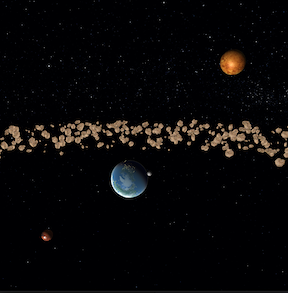

## OpenGL Planet And Atmosphere Renderer

Created a space rendering depicting the sun and the planets upto mars and the asteroid belt.

|  | |

#### TODO:
* Add sun at center
* Move planets to appropriate distances 
* Add physics engine for rotation and revolution
